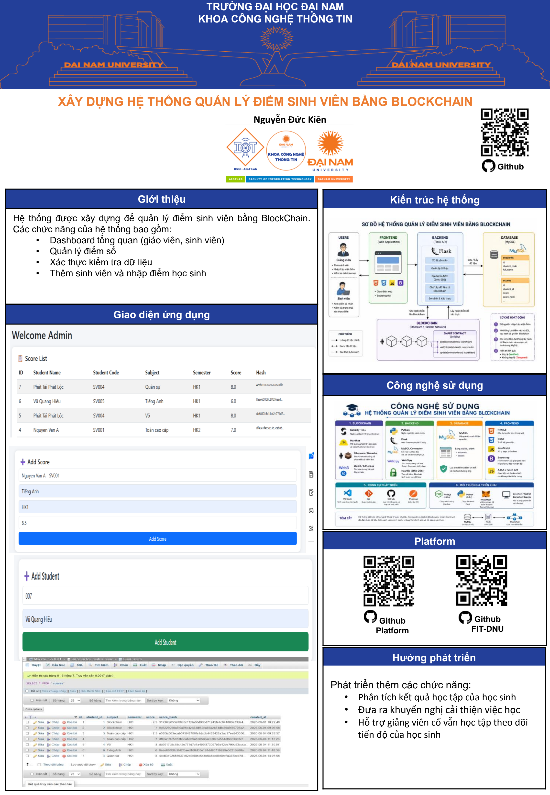
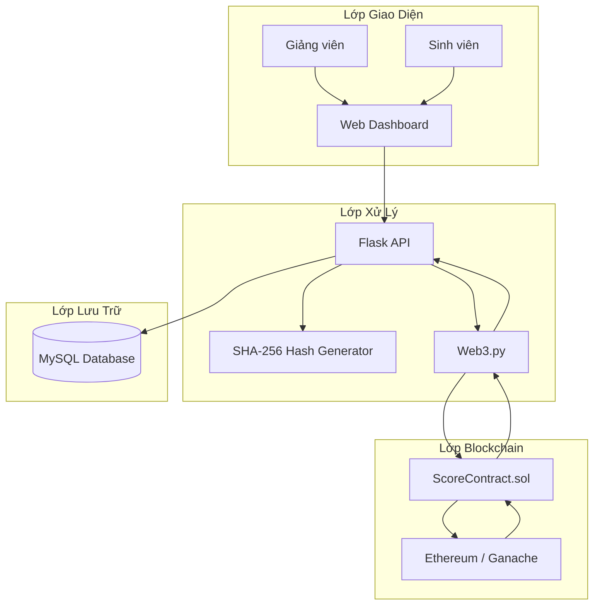

<h2 align="center">
    <a href="https://dainam.edu.vn/vi/khoa-cong-nghe-thong-tin">
    🎓 Faculty of Information Technology (DaiNam University)
    </a>
</h2>
</h2>
<h2 align="center">
    PLATFORM ERP
</h2>
<div align="center">
    <p align="center">
        
        
    </p>

[](https://dainam.edu.vn/vi/khoa-cong-nghe-thong-tin)
[](https://dainam.edu.vn)

## 📌 Poster đề tài

<p align="center">
  
</p>
</div>

## 🎯 Điểm nổi bật của đề tài

* **Minh bạch và toàn vẹn dữ liệu điểm số:** Mọi dữ liệu xác thực điểm đều được ghi nhận trên Blockchain thông qua mã băm (Hash), đảm bảo không thể chỉnh sửa hoặc giả mạo dữ liệu mà không bị phát hiện.

* **Bảo mật cấp độ Smart Contract:**

  * Lưu trữ hash điểm trên Blockchain nhằm đảm bảo tính bất biến của dữ liệu.
  * Phân quyền quản lý dữ liệu điểm giữa giảng viên và sinh viên.
  * Chỉ người có quyền mới được phép cập nhật dữ liệu điểm và ghi nhận hash mới lên Blockchain.

* **Mô hình lưu trữ Hybrid (Web2 + Web3):**

  * MySQL lưu trữ dữ liệu điểm chi tiết (Off-chain).
  * Blockchain lưu trữ hash xác thực (On-chain).
  * Tối ưu chi phí lưu trữ và hiệu năng hệ thống.

* **Trải nghiệm người dùng hiện đại:**

  * Giao diện Dashboard trực quan.
  * Theo dõi trạng thái xác thực dữ liệu theo thời gian thực.
  * Hỗ trợ kiểm tra tính toàn vẹn của điểm số nhanh chóng và minh bạch.

---

## ⚙️ Kiến trúc hệ thống (System Architecture)



---

## 📁 Cấu trúc thư mục dự án (Project Directory Structure)

```text
Blockchain-Grading-System
├── 📁 blockchain/                 # Smart Contract Blockchain
│   ├── 📁 contracts/
│   │   └── 📄 ScoreContract.sol
│   │   └── 📄 blockchain_utils.py
│   │   └── 📄 config.py
│   │   └── 📄 hash_utils.py
│   │   └── 📄 database.py
│
├── 📁 backend/                    # Flask Backend
│   ├── 📄 app.py
│   ├── 📄 requirements.txt
│   
│
├── 📁 frontend/                   # Giao diện Web
│   ├── 📁 templates/
│   └──
│   └── 📄 index.html
│   └── 📄 login.html
│   └── 📄 teacher_dashboard
│   └── 📄 student_dashboard
│
├── 📁 database/
│   └── 📄 student_score.sql
│
└── 📄 README.md
```

---

## 💻 Bộ công cụ & Công nghệ sử dụng

### 🔗 Blockchain

* Solidity `^0.8.x`
* Hardhat
* Ethereum / Ganache
* Ethers.js / Web3.py

### 🖥️ Backend

* Python
* Flask
* MySQL Connector
* hashlib (SHA-256)

### 🌐 Frontend

* HTML5
* CSS3
* JavaScript
* Bootstrap

### 🗄️ Database

* MySQL

---

## 🚀 Hướng dẫn cài đặt & Chạy thử nghiệm Local

### 1. Yêu cầu tiên quyết

* Node.js `>=18`
* Python `>=3.8`
* MySQL Server
* MetaMask (nếu sử dụng Testnet)

---

### 2. Cài đặt thư viện

#### Blockchain

```bash
cd blockchain
npm install
```

#### Backend

```bash
cd backend
pip install -r requirements.txt
```

---

### 3. Khởi động Blockchain Local

```bash
cd blockchain

npx hardhat node
```

Blockchain sẽ chạy tại:

```text
http://127.0.0.1:8545
```

---

### 4. Deploy Smart Contract

```bash
npx hardhat run scripts/deploy.js --network localhost
```

Sau khi deploy:

* Sao chép Contract Address
* Sao chép ABI
* Cập nhật vào Backend

---

### 5. Cấu hình Backend

Tạo file `.env`

```env
RPC_URL=http://localhost:8545

PRIVATE_KEY=your_private_key

CONTRACT_ADDRESS=your_contract_address

DB_HOST=localhost
DB_USER=root
DB_PASSWORD=
DB_NAME=student_score

PORT=5000
```

---

### 6. Chạy Backend

```bash
python app.py
```

Backend hoạt động tại:

```text
http://localhost:5000
```

---

### 7. Chạy Frontend

Mở:

```text
frontend/templates/index.html
```

hoặc sử dụng:

```text
VS Code Live Server
```

---

## 🔐 Cơ chế xác thực dữ liệu

### Giai đoạn 1: Lưu dữ liệu

* Giảng viên nhập điểm sinh viên.
* Hệ thống lưu dữ liệu vào MySQL.

### Giai đoạn 2: Tạo Hash

* Hệ thống sử dụng SHA-256 để tạo mã hash từ dữ liệu điểm.

### Giai đoạn 3: Ghi Blockchain

* Hash được gửi lên Smart Contract.
* Blockchain lưu trữ hash để đảm bảo tính bất biến.

### Giai đoạn 4: Xác thực

* Hệ thống lấy hash từ MySQL.
* Hệ thống lấy hash từ Blockchain.
* So sánh hai giá trị.

Kết quả:

* ✅ Verified (Dữ liệu hợp lệ)
* ❌ Tampered (Dữ liệu bị thay đổi)

---

## 📊 Cấu trúc cơ sở dữ liệu

### students

| id | student_code | full_name |

### scores

| id | student_id | score | score_hash |

---

## 👨‍🎓 Thông tin tác giả

<div align="center">

| Thông tin                | Nội dung                                          |
| ------------------------ | ------------------------------------------------- |
| **Đề tài**               | Hệ Thống Quản Lý Điểm Sinh Viên Bằng Blockchain   |
| **Sinh viên thực hiện**  | Nguyễn Đức Kiên                                   |
| **Ngành học**            | Công nghệ thông tin                               |
| **Đơn vị đào tạo**       | Khoa Công nghệ Thông tin - Trường Đại học Đại Nam |
| **Giảng viên hướng dẫn** | TS. Trần Đăng Công                                |

